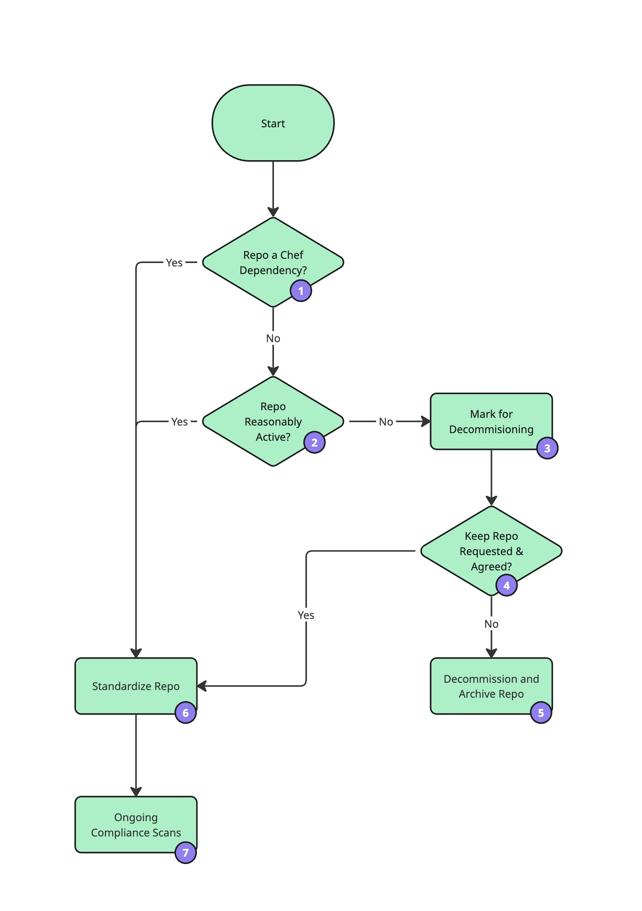
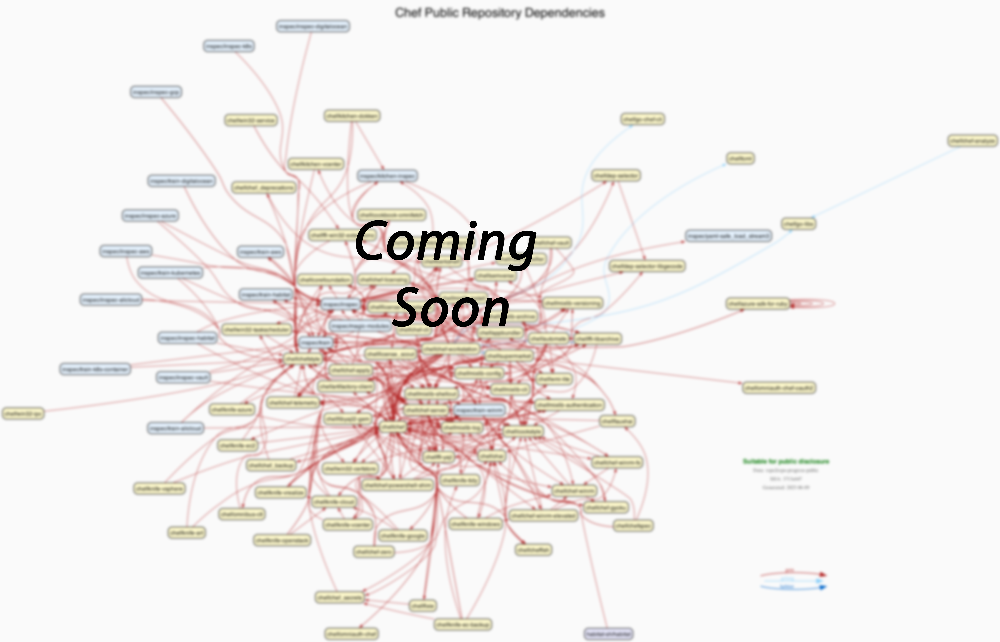
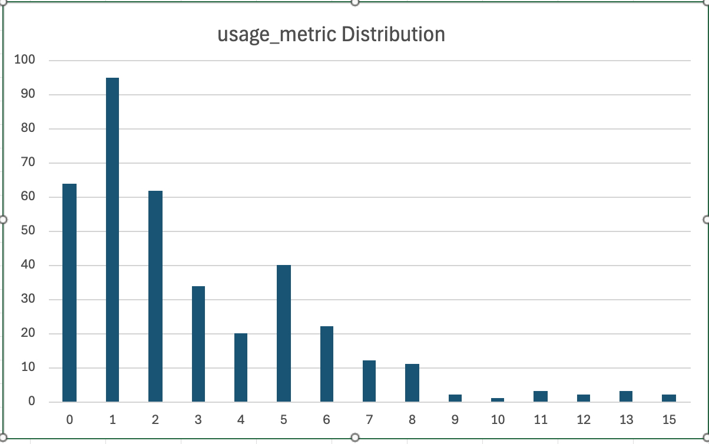
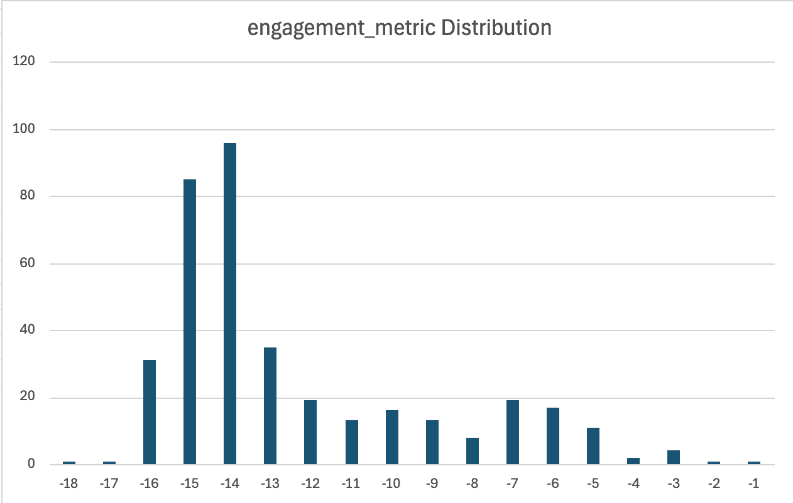

# Chef OSS Standardization Report

## What and Why - The Problem Before Us

### Estate by the Numbers

* 668 public repos across 5 major orgs (chef, inspec, habitat-sh, chef-cookbooks, chef-boneyard)

* 455 have not been pushed to in the last 3 years

### Own, Archive, or Fork

Because there are so many inactive public repos, we aim to screen them.

The goal of screening is to have a clear outcome for each repo: to have a clear Product Owner within Progress, be formally decommissioned, or be handed off to a new maintainer by means of a fork.

### Variation of Boilerplate

 * 180 instances of CONTRIBUTING.md in those 668 public repos

 * Partially clustered, mostly divergent versions of CONTRIBUTING.md

```bash
find var/sparse-mirror -name CONTRIBUTING.md | wc -l 
  180
find var/sparse-mirror -name CONTRIBUTING.md | xargs shasum | cut -d' ' -f1| sort | uniq -c | sort -nr | head -10

 54 f1a335458ace504b14ef364b0fe746dbd3728100
  36 f1869343a33fc7b413379a543ec0846c6e027cd3
   6 bc794798b7a63655d790e52d5c260a4328435fed
   6 3693f0ccf5ea3af05acb758dd561c6255374dda1
   3 1df48717d6f9cffd65def226091d9869ca2326f5
   3 02ef0f10ed933cbbb7d8b617bee324ebcf2a3694
   2 487243665be65e2ace5fccf1e26bb58bf4dca6bb
   2 2d0d960c90acf692a41a7fee07c975d65d095681
   2 1d84980e083161ae43011a4cc3224e599c4aac8b
   2 055f7735bae37917c817fa709c87154da5d5ffeb
   1 ffa0c38b9310f0ecb66b77bb98996e6348b93c6f
   1 f9b4ca69ce96525761e1cffd2c1abf9855dc2b23
   1 f0f80599f1ac27fa2fa0d30a2a4c25863dd5615a
   1 efabdc4efb95100c8631c5a1f5a0f3f2614644db
```

This shows that there are many versions of CONTRIBUTING.md, though many repos have copies of a few editions.

Each repo should link to the corresponding containing project's CONTRIBUTING, not have its own custom copy.

### Other Standardization Issues

Including:
 * Copyright missing or out of date
 * license mismatches between Product, LICENSE, and README
 * Missing or divergent SECURITY.md and CODE_OF_CONDUCT.md
 * Outdated SLA messaging
 * spurious markdown files

## Workflow Overview

Here is an overview of the workflow.



### 1 - Dependency Detection

We use an internal tool, `dep-ferret`, to read the GitHub-provided SBOM of each repo associated with a each major Chef product, then map the dependencies back to their source repos, forming a repo-to-repo graph. This reveals the set of repos that Chef relies on.

`dep-ferret` processing only currently supports Ruby and golang dependencies, but data is available for nodejs, rust, githubactions, and Habitat dependencies, pending integration.  Once data is complete, we will share the full results.

In the meantime, here is a glimpse of `dep-ferret`'s perspective on the dependency map for Chef.



### 2 - Activity Metrics

We need some way quantitative way of determining which repos are being actively used by the community. 

As activity metrics will change over time and will be affected by remediation activities, we are snapshotting activity data on a weekly basis.

We have developed two metrics.

#### usage_metric

Based on three values:

##### recent_clone_count

GitHub stat on unique clones in the last 14 days. May reflect automation.

##### recent_pageview_count

GitHub stat on unique pageviews in last 14 days.  Expected to represent humans.

##### significant_fork_count

 A fork is considered "significant" if it meets all of the following criteria:
- Has public visibility
- Has at least 1 star
- Has been pushed to within the last 6 months
- Is not owned by the same organization as the parent repository

##### usage_metric formula

```
log(recent_clone_count) + log(recent_pageview_count) + significant_fork_count
```

Note that fork count is not logarithmic.

This formula may be revised. It is over-sensitive to recentness, but that is best data available.

##### usage_metric data




This excludes chef-boneyard.

#### engagement_metric

The engagement metric measures Progress and community activity in the repository. It is comprised of three logarithmic values.

##### days_since_pushed_at_import

Days since the repo was last pushed to at the time of data acquisition.

##### days_since_updated_at_import

Days since the repo was administratively updated at the time of data acquisition.

##### issue_count

Number of open GitHub issues.

##### engagement_metric formula

```
log(days_since_pushed_at_import) + 
log(days_since_updated_at_import) + 
log(issue_count)
```

##### engagement_metric data



This excludes chef-boneyard.

### 3 - Mark for Decommissioning

If a repo appears to be inactive and unused, Chef will mark the repo for decommissioning, by:

 1. Opening an issue in the repo with the title "Repo being considered for archival" and the label `oss-standards`
 1. Adding a banner to the README with a link to the "Considered" issue and a link to an informational page (in this repo)

The message will make clear that there will be 14 days from the time of notice until archival, unless a Keep Request is made.

### 4 - Keep Requests

Make a request to keep a repo unarchived by:

 1. Reacting thumbs-down to the Considered for Archival issue
 1. Explaining your need in a comment.

Keep requests will be processed by humans, and the Considered Issues will be checked daily for new comments.

If a repo is selected to be kept, it will be added to the Keep list, and the Considered Issue will be closed.

Progress cannot honor all requests to keep repos open. Projects may have a future as a forked project, if a new maintainer can be found. Check the LICENSE in each project (Apache v2 is the Chef standard) for forking terms.

### 5 - Decommissioning Actions 

We are still determining the exact set of actions to be taken when decomming a repo.

At least the following will happen:
 - all PRs closed
 - all issues closed
 - Replace CONTRIBUTING with thank you message
 - Message explaining archival added to README
 - A successor message, if any, similar to: "At the time of archival (Date), the owners of repo foo/bar have requested to be listed as the successor fork. PSC is not affiliated with and cannot predict the future of this project."
 - move to chef-boneyard org
 - repo archived

### 6 - Standardization Actions

We are still determining the exact set of actions to take when standardizaing a repo.

At least the following will occur:

 1. Replace CONTRIBUTING.md with a link to chef-oss-proactices/projects/*/contributing.md
 1. Add SECURITY.md, a link to chef-oss-practices
 1. Add CODE_OF_CONDUCT.md, a link to chef-oss-practices
 1. Verify README content regarding license, LICENSE file content, and EULA/MLSA content if needed.
 1. Update or create COPYRIGHT
 1. Check for any unusual markdown files (those not on the list)
 1. Check all READMEs for governance information and link to chef-oss-practices
 1.  Remove SLA verbiage from README

Several other steps are being explored.

#### Remediation Approaches

We are planning to open PRs under automation as much as possible, with human approval when appropriate, and automated merging if it becomes obviously routine.

We plan to use an estate-wide label, `oss-standards`, to tag PRs and Issues associated with the effort. 

### 7 - Ongoing Drift Detection

We are developing an InSpec profile that describes the desired state of the repos, and will run it regularly, along with an GitHub Action component to self-scan.


